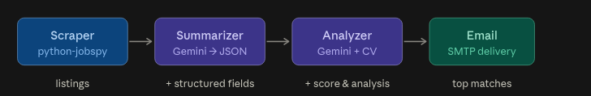
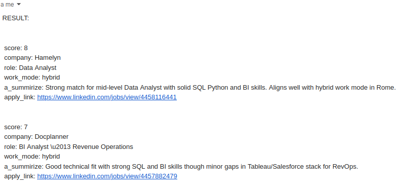

# 🔍 SnapplAI — AI-Powered LinkedIn Job Alerts
 
Stop refreshing LinkedIn. This pipeline scrapes new job listings based on your settings, uses AI agents to summarize each one and score it against your CV, then delivers only the best matches straight to your inbox 📬 — so you're always first to apply 🚀
 


 
---
 
## 📑 Table of Contents
 
- [The Problem](#-the-problem)
- [How It Works](#-how-it-works)
- [Tech Stack](#-tech-stack)
- [Pipeline Architecture](#-pipeline-architecture)
- [AI Output Fields](#-ai-output-fields)
- [Setup](#-setup)
- [Project Structure](#-project-structure)
- [Roadmap v2](#-roadmap-v2)
- [Contributing](#-contributing)
- [License](#-license)
---
 
## 🎯 The Problem
 
Job hunting on LinkedIn is a full-time job in itself. New listings appear daily, most are irrelevant, and by the time you spot a good one, 200 people have already applied.
 
**SnapplAI flips the game:** it runs on a schedule, scrapes fresh listings, lets AI read and score every single one against *your* CV, and emails you only the top matches — before the crowd even sees them.
 
---
 
## ⚙️ How It Works
 
The pipeline runs in 4 sequential steps, fully automated:
 
**1. Scrape** → `job_scraper()` pulls fresh listings from LinkedIn based on your search settings (role, location, filters) using python-jobspy.
 
**2. Summarize** → `agentic_summarize()` sends each job description to Gemini, which extracts structured fields (title, seniority, skills, salary, etc.) as clean JSON.
 
**3. Analyze** → `agentic_analyze()` reads your CV and scores each listing on how well it matches your profile. Chain-of-thought enforced: the model writes `analysis` before `score` in the JSON schema, so reasoning comes before judgment.
 
**4. Deliver** → `send_email()` builds an email with the top-scored jobs and sends it to your inbox via SMTP.
 
**Key principle:** AI reads and evaluates. Python orchestrates and delivers. No frameworks, no agents-calling-agents — just a clean data pipeline with LLM calls where they matter.
 
---
## 🔧 Tech Stack
 
| Component | Technology |
|-----------|-----------|
| LLM | Google GenAI SDK — `gemini-3.5-flash-lite` |
| Scraping | python-jobspy (LinkedIn) |
| Data | pandas, PyPDF / PyMuPDF |
| Parsing | BeautifulSoup4 |
| Email | smtplib (SMTP) |
| Config | python-dotenv |
 
---

## 🏗️ Pipeline Architecture
 

 
The entire pipeline operates on a single pandas DataFrame that gets enriched at each step. No intermediate files, no database — everything flows through memory.
 
---
 
## 📊 AI Output Fields
 


Each job in the email is ranked by match score and includes company, role, work mode, a one-line AI summary explaining why it matched (or didn't), and a direct apply link to the LinkedIn listing.

 
---
 
## 🚀 Setup
 
### Requirements
 
- Python 3.10 to 3.12
- Google AI API Key (free tier available)
- Gmail App Password (for SMTP delivery)
### Installation
 
```bash
git clone https://github.com/TDK-99/SnapplAI.git
cd SnapplAI
pip install -r requirements.txt
cp example_env.txt .env
```
 
### Configuration
 
**1. API Key** — Get a free Google AI API key from [Google AI Studio](https://aistudio.google.com/apikey)
 
**2. Email** — Generate a Gmail App Password: Google Account → Security → 2-Step Verification → App Passwords
 
**3. Your CV** — Place your CV (PDF) in the `your_cv_config/` folder. The pipeline reads it with PyPDF and injects it into the analyzer's prompt.
 
**4. .env file** — Fill in your credentials:
 
```env
GOOGLE_API_KEY=your_google_api_key
GMAIL_USER=your_email@gmail.com
GMAIL_APP_PASSWORD=your_app_password

```
 
### Search Settings
 
 Configure your job search parameters (role, location, filters) in the scraper config. The pipeline uses python-jobspy under the hood — check their docs for all available filters.
 Use file_config.txt for create your file_config.env

--- 
## 📁 Project Structure
 
```
SnapplAI/
├── main.py                 # Entry point — runs the 4-step pipeline
├── src/
│   ├── daily_scraper.py    # LinkedIn scraping with python-jobspy
│   ├── ai_agents.py        # Gemini calls: summarize + analyze
│   └── smtp.py             # Email builder and SMTP sender
├── your_cv_config/
│   ├── .gitkeep            # Keeps folder tracked in git
│   ├── file_config.env     # Your settings (role, location, filters)
│   ├── file_config.txt     # Additional config parameters
│   └── Your_CV.pdf         # Your CV goes here (PDF)
├── .github/
│   └── workflows/
│       └── snapplai.yml    # GitHub Actions workflow (scheduled + manual)
├── Dockerfile              # Run anywhere with Docker
├── .env                    # API keys and SMTP credentials (git-ignored)
├── example_env.txt         # Template for .env variables
├── requirements.txt        # Dependencies
├── LICENSE                 # MIT
└── README.md
```

 
---
## 🛣️ Roadmap v2
 
- **Multi-country scraping** — search across 2+ countries in a single run (custom feature, not supported by python-jobspy out of the box)
- **Excel/DB deduplication** — persistent storage to compare runs and filter out already-seen listings, so you never score the same job twice
- **Scoring calibration** — benchmark AI scores against known good/bad matches to improve match quality
- **Output redesign** — better visual formatting for the email report (job cards, readability, direct links)

 
## 🤝 Contributing

Contributions are welcome — bug fixes, new features, or docs improvements.

- **Issues** — Report bugs or suggest features
- **Pull Requests** — Fork, build, submit

---
 
## 📄 License
 
MIT — see [LICENSE](LICENSE)
